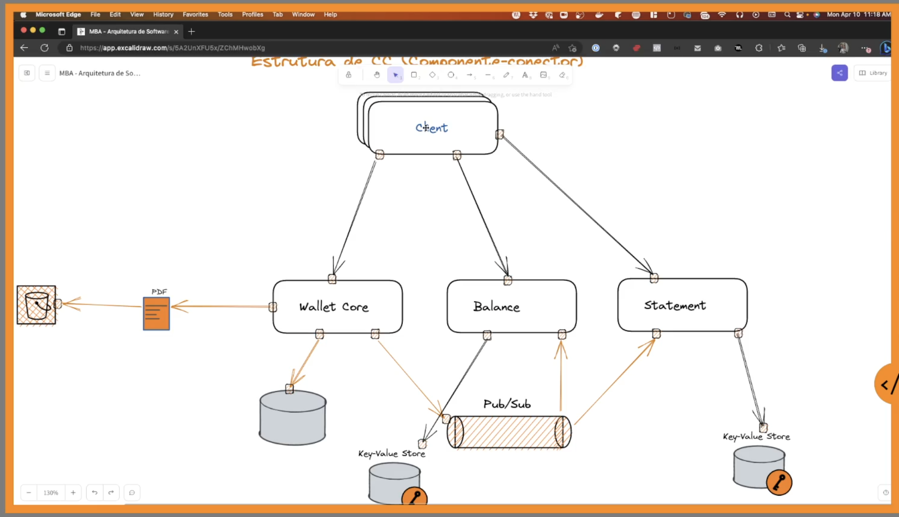
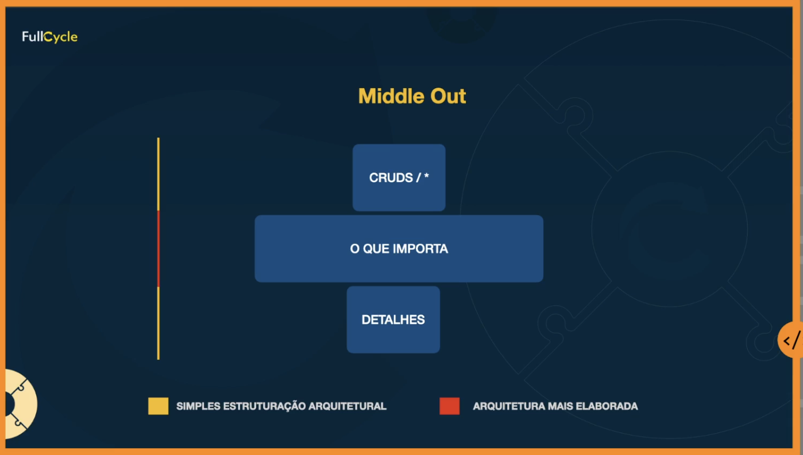
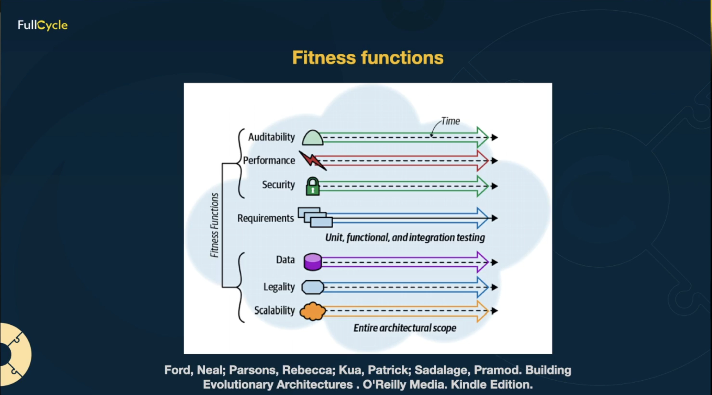
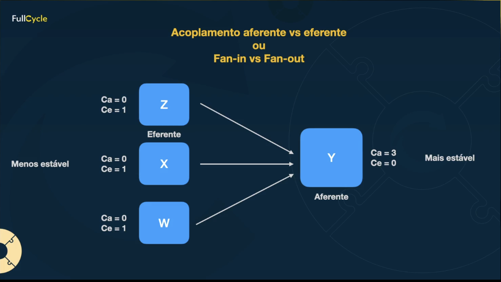
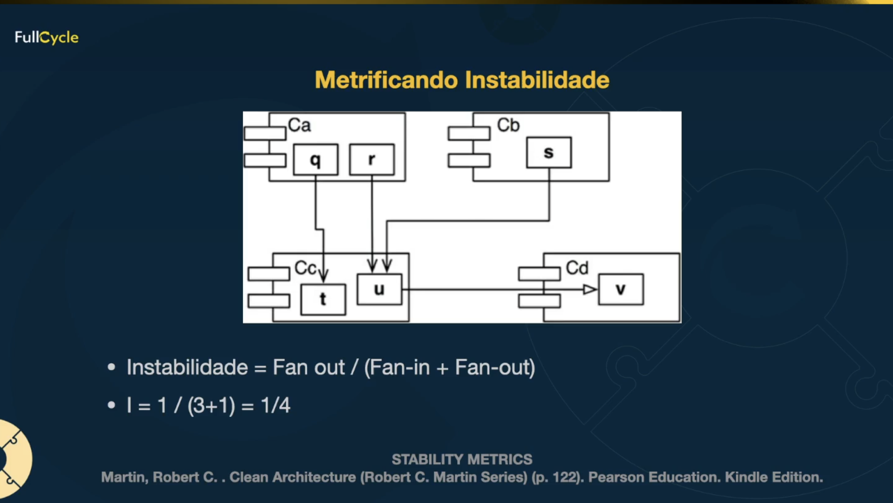

## Resumo 
### Tipos de arquitetura:
- Software - mais próximo ao código, fazer com que o software dure mais tempo
- Solução - ajuda a desenhar a solução pra entregar mais valor, mais próximo ao cliente, entender a solução como um todo
- Tecnológica - vem de tecnologias específicas (ferramentas especializadas)
- Corporativa - como a empresa funciona como um todo (pessoas, processos, tecnologia, governança)

### Arquitetura de software
* Diretamente ligada ao processo de desenvolvimento
* Afeta diretamente a estrutura organizacional da empresa
    * formação dos times
    * estrutura dos componentes do software

Papel do arquiteto de software:
- Transformar requisitos de negócio em padrões de arquitetura
- Orquestrar pessoas desenvolvedoras e experts de domínio
- Entender de forma profunda conceitos e modelos arquiteturais
- Auxilia na tomada de decisao nos momentos de crise
- Reforca boas praticas de desenvolvimento

Diferenca entre arquitetura e design de software:
| Arquitetura de Software | Design de Software |
| ---------------------- | ------------------ |
| Escopo global ou alto nivel | Escopo local |


Estruturas - Coisas que tenho que pensar quando arquitetando um software:

Componente-conector:

Exemplo: todas "bolinhas" apresentadas no desenho sao formas de conectar
- Iteracao entre elementos para garantir o funcionamento do sistema
- Componentes -> comportamento do sistema
    * Services, clients, servers, pipelines
- Iteracoes -> conectores (iteracoes entre os componentes)
    * Como os conectores se comunicam (protocolos, APIs, eventos)

Módulos
- Unidade de software
- Pacotes
- Responsabilidades funcionais
- Camadas
- Visão mais micro

Estrutura de Alocação:
- E a relacao das estruturas componente-conector e módulos e como elas se conectam com "não software"
    * Tipo de computacao (tipo de maquina)
    * Ambientes (onde vou testar)
    * Testes
    * Build
    * Deployment


### Efeito "Ivory tower" ou torre de marfim
Quando o arquiteto se isola do dia-a-dia do time de desenvolvimento, se torna um especialista teórico que pensa estar resolvendo problemas, mas esta completamente desconectado da realidade do time e do produto.

## Decisões arquiteturais
Decisões "erradas" para iniciar o desenvolvimento de software:
- Problemas de waterfall - muita especificação sem geração de código
- Arquitetura de CRUD 
- Começar pelas ferramentas
- Começar sem testes
- Começar sem processos de CI (continous integration)

Por onde começar:



Middle-out: foco em começar o desenvolvimento pelos componentes core e mais críticos do sistema.
Maior flexibilidade, ou seja, menor complexidade para integração com outros sistemas e começar pelo meio permite mais mudanças, desenvolvimento incremental e facilidade na escala.

## Dimensões e fitness functions

Arquitetura ```dimensional:

* Técnica: Tecnologia, frameworks, acoplamento, testes, performance.

* Dados: Como dados irão trafegar, qual formato, como vai acontecer a sincronização dos dados...

* Segurança: rate limit, evitar man in the middle, mTLS, formato de log...

* Operacional: Como vai operar, observabilidade, pipelines, testes, rollback...


### Fitness functions
Fitness functions são uma forma de **medir** a efetividade, performance e fatores relevantes de acordo com a arquitetura de software.
Ela é uma parte do acompanhamento do software conforme ele evolui.
Para realizar essa medição de efetividades é importante identificar os aspectos críticos e deixá-los de uma forma mensurável e com objetivos claros.

Alguns critérios comuns de fitness functions:
- Performance
- Modularizacao
- Manutenibilidade
- Escalabilidade
- Segurança




### Acoplamento
**ToDo: ver o video da aula**
Livro: Release It! - Michael T. Nygard

Tipos de acoplamento:

Operacional: depende de algo que esta com problema e por isso o sistema nao funciona

Desenvolvimento: mudanças obrigatoriamente coordenadas entre dois módulos

Semântico: Dependência de terminologias entre sistemas (deixar o linguajar equivalente entre varios contextos diferentes)

Funcional: ter um módulo core que é utilizado por vários outros sistemas e esses dependem disso, entao uma mudança nesse módulo pode encadear outros problemas.

Acidental: Mudanças que acontecem "sem motivo" como alterar o contrato de uma API.

Acoplamento eferente ou aferente (fan-out ou fan-in)

eferente = se alguem depende de mim (mais estável), normalmente são mais propensos a falhas devido à dependência do bom funcionamento de outros componentes.

aferente = eu dependo de alguem (menos estável), normalmente são mais críticos pois afetam diretamente outros componetes.



#### Metrificando instabilidade:

> fan-out = eferente
>
> fan-in = aferente

Instabilidade = Fan-out / (Fan-in + Fan-out)

range: 0 (totalmente estável) a 1 (totalmente instável)

exemplo:


Nesse exemplo o componente Cc é o mais crítico, pois existem mais componentes que dependem dele. A aferencia (fan-in) = 3 e a eferencia (fan-out) = 1. Logo, a instabilidade = 1/(3+1) = 0,25 (mais estável).
