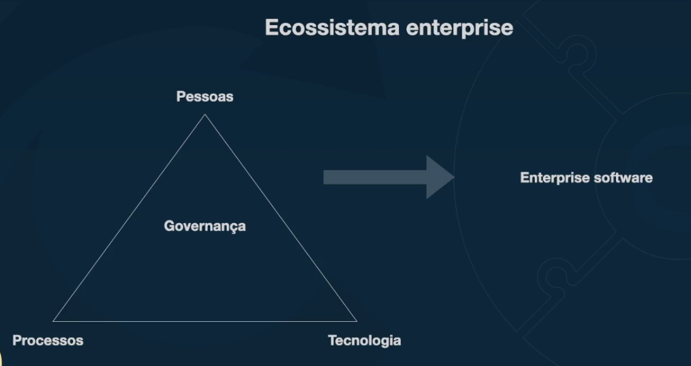

## Software enterprise

### O que é
Exemplos:
- Grande empresa ou unidade de negocios (BU - Business Unit)
- Agencia de governo ou uma unidade de agencia governamental
- Multinacional que engloba diferentes tipos de negocio
- Pequenas e medias empresas que operam de forma global

### Ecossistema enterprise

Software enterprise caracteristícas:
- Escalabilidade
- Disponibilidade (custo, estratégia)
- Segurança (o que voce sabe, o que voce tem e o que voce é)
- Customização e modularização (no-code/low-code)
- Integração
- Observabilidade

## Arquitetura de solução
* Processo de definição de estrutura, componentes, módulos, interfaces de uma solução de software para satisfazer requisitos funcionais e não funcionais bem como seu comportamento;
* Define/sugere a stack de tecnologia, plataformas, ferramentas, infraestrutura que serão utilizadas para implementar tal solução;
* Provê um blueprint do desenho e caminhos do desenvolvimento, integração de uma soluçao para sua melhor eficiência;
* Normalmente é "praticada" em sistemas de software enterprise

### Considerações para arquitetar uma solução
- Alinhamento com objetivos de negócio
- Flexibilidade
- Reúsabilidade
- Interoperabilidade (como outros sistemas irão interagir com a solução)
- Manutenibilidade
- Compliance com normas regulatórias
- Portabilidade

TCO - Total Cost of Ownership 
É uma métrica financeira que representa o custo total de comprar, desenvolver e operar uma solução ao longo do tempo.
- Não incluí apenas o preço inicial, mas também os custos de manutenção
- Formato de custos -> Aquisição, implementação, manutenção, operação e inativação

Diferenças entre "enterprise architecture" (EA) e "solution architecture" (SA)

| Arquitetura de Empresa (EA) | Arquitetura de Solução (SA) |
| -------------------------------------------- | ---------------------------- |
| Visão coorporativa como um todo | Foco em uma solução específica |
| Planejamento, implementação da estrutura organaziacional (pessoas, processos e tecnologia) | Define estrutura, características, comportamentos e relações de um sistema específico |